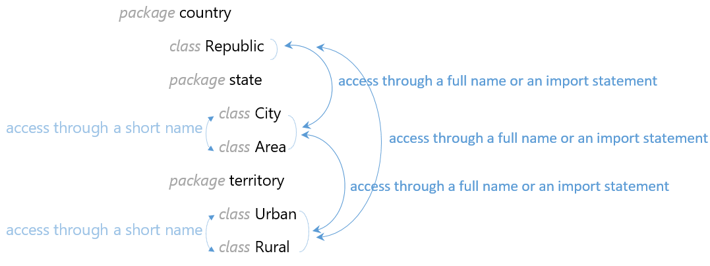

# Glossary of Java terms

## Class

A class body can include fields, methods, and constructors. Fields store data, methods define behavior and constructors allow us to create and initialize new objects of the class. Not all Java classes have fields and methods so sometimes you will see classes without them.

- names are always camel case, beginning with a capital

### Field

A field is a variable that stores data.

```java
class Patient {

    String name; // field
    int age; // field
    float height; // field
}
```

- names are always lower case (camel case if multiple words)

### Methods

### Constructors

When we define our own constructor, the **default no-argument constructor** disappears. We can overload constructors with many different parameter lists.

```java
class Patient {

    String name;
    int age;
    float height;

    public Patient(String name, int age, float height) {
        this.name = name;
        this.age = age;
        this.height = height;
    }
	public Patient(String name) {
        this.name = name;
    }
}
```

- A constructor has the same name as the class containing it
- A constructor has no return type, not even void

## Packages

Packages provide a mechanism for grouping classes together in the same module (or package). If package name not provided, it's in the **default package**, but this is not recommended as you can't access it from elsewhere.

```java
package org.company.webapp.data;

public class User {
}
```

- names are always lower case
- it is generally recommended to start your package hierarchy with the reversed domain name of your company (or another organization)



### importing packages

```java
import org.hyperskill.java.packages.theory.p3.*; // import all classes from the package
import java.util.Scanner; // import standard class from java.util package
```

### static imports

```java
package org.hyperskill.java.packages.theory;

import static java.util.Arrays.*; // instead of the statement "import java.util.Arrays;"

public class Main {

    public static void main(String[] args) {
        int[] numbers = { 10, 4, 5, 47, 5, 12 }; // an array

        sort(numbers); // instead of writing Arrays.sort(...)

        int[] copy = copyOf(numbers, numbers.length); // instead of writing Arrays.copyOf(...)
    }
}
```

## Access modifiers

### `private`

### `public`

### `protected`

### default

## Non-access modifiers

### `static`

It belongs to the class as a whole.

### instance

It belongs to the objects from that class. An instance method can only be invoked through an instance of the class.
